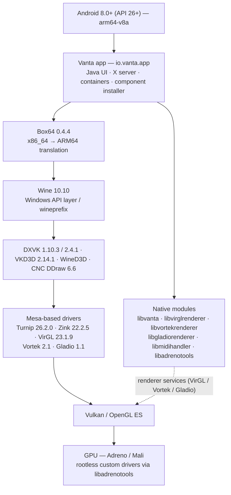

<p align="center">
  <b>VANTA</b><br>
  Windows compatibility environment for Android
</p>

<p align="center">
  <a href="https://img.shields.io/badge/Android-8.0%2B%20(API%2026)-3DDC84?logo=android&logoColor=white"></a>
  <a href="https://img.shields.io/badge/architecture-ARM64-2F6FED"></a>
  <a href="https://www.winehq.org/"></a>
  <a href="https://www.vulkan.org/"></a>
  <a href="LICENSE"></a>
  <a href="https://github.com/brunodev85/winlator"></a>
</p>

<!--
  Demo media placeholder (intentionally commented out so no broken link is rendered):

  <p align="center">
    
  </p>

  The real Vanta demo GIF will be added at docs/media/vanta-demo.gif in a future update.
  See docs/media/README.md for the media conventions.
-->

---

## About Vanta

Vanta is an Android application that runs Windows (x86_64) applications and games on Android
devices, using **Wine** on top of an **x86_64 → ARM64** translation layer (**Box64**) and the
graphics stack below it (**DXVK / VKD3D / WineD3D** on top of **Mesa** drivers such as **Turnip**).

**Vanta is a derivative project.** It is based on (forked from) **Winlator** by
[brunodev85](https://github.com/brunodev85/winlator). The application layer, the native
components and the runtime assets of this repository originate from that project. Vanta is not
written from scratch, and credit for the original work belongs to the Winlator author and
contributors. See [CREDITS.md](CREDITS.md) for the full attribution.

Vanta adds its own visual identity and modernized Android interface, along with per-container
compatibility selections for Wine, DXVK and Box64. It remains an open-source derivative of
Winlator and retains upstream attribution and compatibility code.

## Features

### AVAILABLE NOW

Present in the current code base (inherited from Winlator and still functional in this tree):

- Container management: create, edit, duplicate and run isolated Windows environments.
- Wine Manager for imported x86_64 Wine packages; built-in Wine **10.10** remains the fallback.
- Graphics driver selection per container, with separate Vulkan and OpenGL choices:
  **Turnip**, **Vortek**, **Zink**, **VirGL** and **Gladio** — with configuration dialogs for
  Turnip, Vortek and VirGL.
- DirectX wrappers: for Direct3D, **WineD3D** or **DXVK** (bundled `1.10.3` and `2.4.1`); for
  Direct3D 12, **VKD3D** `2.14.1`; plus **CNC DDraw** `6.6` as DirectDraw wrapper — each with its
  own configuration dialog (framerate cap, max device memory, custom GPU device, DDraw wrapper).
  `D7VK 1.11` and `D8VK 1.0` packages are bundled and handled by the runtime, but are not exposed
  in the wrapper picker today.
- **Box64** `0.4.4` with Compatibility, Balanced, Performance and custom presets; supported
  Dynarec controls are based on the bundled Box64 variable definitions. Per-container Box64
  version and preset selections reach the runtime.
- Input controls editor, touch control profiles, external controller/gamepad bindings and gamepad models.
- Audio: PulseAudio and ALSA backends, SoundFont selection and MIDI support.
- File manager, shortcuts manager, task manager, active-window list, screen effects
  (brightness/contrast), storage info and Wine debug channel control.
- In-app component installer that can download or import additional component packages.
- **DXVK Manager** lists real bundled/imported versions, identifies bundled defaults and protects
  in-use packages. DXVK **1.10.3** and **2.4.1** are bundled and selectable per container.
- Custom environment variables, CPU affinity, screen size and container-level tuning options.

### PLANNED / EXPERIMENTAL

Not implemented, not tested, or only at the design stage — do not treat any item below as shipped:

- **Compatibility Manager** — curated per-game compatibility profiles.
- **Turnip Manager** — multiple Turnip driver versions managed by Vanta.
- **FEX** — FEX as an experimental translation backend (FEX is **not** present in this repository).
- **Performance presets** — broader, cross-stack performance presets (Box64 presets already exist,
  see *Available now*).
- **Compatibility documentation** — an evolving, community-fed game/app compatibility matrix.
- **Vanta-hosted component repository** — today installable components are fetched from the
  Winlator upstream repository (see [CREDITS.md](CREDITS.md)).

## Architecture



Notes:

- Windows executables are executed through **Box64**, which translates x86_64 instructions for the
  ARM64 device; Wine provides the Windows API layer inside the container.
- The X server, the renderer services and the component installer live in the Android/Java layer.
- Only **Box64** is bundled in this repository; Box86 is credited upstream but no Box86 binary is
  part of the current asset set.

More detail: [docs/architecture.md](docs/architecture.md).

## Compatibility Stack

Versions below are the ones declared in the current source tree
(`app/src/main/java/io/vanta/app/core/DefaultVersion.java` and `WineInfo.java`):

| Component | Version in tree | Role |
|---|---|---|
| Android | minSdk 26 (Android 8.0), targetSdk 28, compileSdk 35 | Host platform |
| ABI | `arm64-v8a` only | Target architecture |
| Wine | 10.10 (main) | Windows API implementation |
| Box64 | 0.4.4 | x86_64 → ARM64 translation |
| DXVK | 1.10.3 and 2.4.1 | Direct3D 8/9/10/11 → Vulkan |
| D7VK / D8VK | 1.11 / 1.0 | Direct3D 7 / Direct3D 8 → Vulkan |
| VKD3D | 2.14.1 | Direct3D 12 → Vulkan |
| WineD3D | matches Wine 10.10 | Direct3D → OpenGL fallback |
| Turnip (Mesa) | 26.2.0 | Vulkan driver for Adreno |
| Zink (Mesa) | 22.2.5 | OpenGL → Vulkan |
| VirGL (Mesa) | 23.1.9 | Virtualized OpenGL |
| Vortek | 2.1 | Renderer component |
| Gladio | 1.1 | OpenGL renderer component |
| CNC DDraw | 6.6 | DirectDraw implementation for classic games |
| PulseAudio | 13.0 libraries bundled | Audio server |
| Box86 | not bundled | credited upstream, not shipped here |

`D7VK` and `D8VK` packages are bundled and understood by the runtime; the wrapper picker in the UI
currently exposes DXVK, WineD3D and VKD3D only.

## Downloads

All Vanta builds are distributed through the **GitHub Releases** page of this repository:

**[https://github.com/Ryuex/vanta/releases](https://github.com/Ryuex/vanta/releases)**

- **Alpha builds are experimental.** Expect crashes, untested games and unfinished UI. They are
  intended for testing and feedback, not for production use.
- Builds target **ARM64 (arm64-v8a)** devices running **Android 8.0 or newer**.
- If no release is listed yet, the project can still be built locally — see
  [docs/building.md](docs/building.md).

## Current Development Status

- [x] Fork/base established from Winlator, with upstream history preserved.
- [x] Compilable baseline confirmed: a debug APK (`app-debug.apk`) was produced locally from this tree.
- [x] Vanta identity started: application id and namespace `io.vanta.app`, app label `Vanta`,
      native module directory renamed to `vanta`.
- [x] Initial repository documentation (this file plus `docs/`).
- [ ] First Vanta release published on GitHub Releases.
- [ ] First-party Vanta UI.
- [ ] Runtime/game compatibility validation — **no runtime testing has been carried out or
      reported for Vanta builds at this point.**

`versionName 11.2` / `versionCode 33` are inherited from the upstream baseline; Vanta's own
release numbering will be defined when the first Vanta release is published.

## Roadmap

- [x] Fork/base established from Winlator with credits and licenses preserved.
- [x] Compilable baseline confirmed (local debug APK build).
- [x] Vanta identity (application id, namespace, app label, native module naming).
- [x] Initial documentation set (`README`, `docs/`, `CREDITS`, `CHANGELOG`, `CONTRIBUTING`).
- [x] Issue templates for bugs, game compatibility and feature requests.
- [ ] First experimental release on GitHub Releases.
- [ ] Vanta interface (first-party UI).
- [ ] Compatibility Manager (per-game compatibility profiles).
- [ ] DXVK Manager (multiple DXVK versions handled by Vanta).
- [ ] Turnip Manager (multiple Turnip drivers handled by Vanta).
- [ ] Box64 profiles (richer version/profile management).
- [ ] FEX as an experimental backend.
- [ ] Performance presets across the stack (Box64 presets already exist).
- [ ] Compatibility documentation maintained with community reports.

## Building

Requirements: JDK 17, Android SDK (compileSdk 35), NDK `24.0.8215888`, CMake `3.22.1`.

```bash
./gradlew :app:assembleDebug
```

The APK is written to `app/build/outputs/apk/debug/app-debug.apk`.
Full instructions and troubleshooting: [docs/building.md](docs/building.md).

## Documentation

| Document | Contents |
|---|---|
| [docs/README.md](docs/README.md) | Documentation index |
| [docs/architecture.md](docs/architecture.md) | Layer-by-layer architecture and source map |
| [docs/building.md](docs/building.md) | Toolchain and build instructions |
| [docs/compatibility.md](docs/compatibility.md) | Graphics stack, wrappers, reporting guide |
| [docs/media/README.md](docs/media/README.md) | Where screenshots, banners and GIFs go |
| [CHANGELOG.md](CHANGELOG.md) | Vanta changelog |
| [CONTRIBUTING.md](CONTRIBUTING.md) | Branches, PRs and bug reports |
| [CREDITS.md](CREDITS.md) | Upstream and third-party attribution |

## Credits

- **Winlator** by [brunodev85](https://github.com/brunodev85/winlator) — the original project this
  application is based on. Vanta would not exist without it.
- **Wine** ([winehq.org](https://www.winehq.org/))
- **Box86/Box64** by [ptitSeb](https://github.com/ptitSeb)
- **Mesa** (Turnip / Zink / VirGL) ([mesa3d.org](https://www.mesa3d.org))
- **DXVK** ([github.com/doitsujin/dxvk](https://github.com/doitsujin/dxvk))
- **VKD3D** ([gitlab.winehq.org/wine/vkd3d](https://gitlab.winehq.org/wine/vkd3d))
- **GLIBC patches** by [Termux Pacman](https://github.com/termux-pacman/glibc-packages)
- **CNC DDraw** ([github.com/FunkyFr3sh/cnc-ddraw](https://github.com/FunkyFr3sh/cnc-ddraw))
- **libadrenotools** by Billy Laws (BSD-2-Clause, bundled in-tree)
- **FluidSynth** (LGPL-2.1, bundled in-tree)
- **libadrenotools / VirGL** and every other project listed in [CREDITS.md](CREDITS.md)

Full attribution, including in-tree licenses: [CREDITS.md](CREDITS.md).

## License

This project is licensed under the **GNU Lesser General Public License v2.1** — see [LICENSE](LICENSE).

Third-party components remain under their own licenses; license files shipped inside the tree
(such as `app/src/main/cpp/libadrenotools/LICENSE` and `app/src/main/cpp/midihandler/fluidsynth/LICENSE`)
are part of this repository and must be preserved.

<p align="center">
  
</p>
<p align="center"><sub>Logo inherited from Winlator (original project by brunodev85). A dedicated Vanta logo is planned — see docs/media/README.md.</sub></p>
