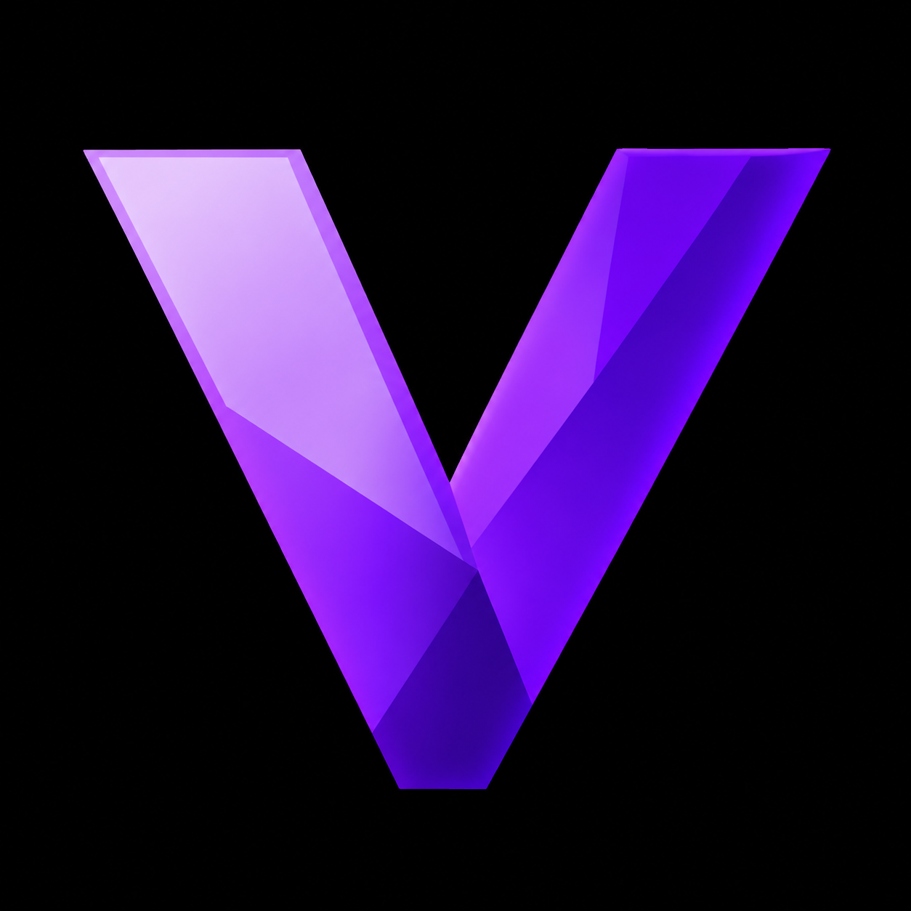

<p align="center">
  
</p>

<h1 align="center">Vanta</h1>

<p align="center">
  Ambiente de compatibilidade Windows para Android
</p>

<p align="center">
  Baseado em Winlator • Wine • Box64 • Mesa • DXVK
</p>

---

> [!WARNING]
> **O Vanta está atualmente em fase experimental.**
>
> Versões de pré-lançamento podem apresentar bugs, travamentos, problemas gráficos, regressões de desempenho ou incompatibilidades específicas de determinados dispositivos.

## Sobre o Vanta

O **Vanta** é um projeto de compatibilidade para Android voltado à execução de aplicativos e jogos Windows x86_64.

O projeto é baseado no **Winlator**, criado por **BrunoSX / brunodev85**, e utiliza tecnologias como Wine, Box64, Mesa, DXVK e VKD3D.

O objetivo do Vanta é expandir essa base com uma interface própria, gerenciamento de runtimes, perfis de compatibilidade, ferramentas de diagnóstico e suporte aprimorado para diferentes GPUs Android.

O Vanta não reivindica autoria sobre o código original do Winlator ou sobre projetos de terceiros utilizados pelo aplicativo.

## Desenvolvimento atual

O desenvolvimento atual do Vanta inclui:

- Gerenciador de Runtime
- Gerenciamento de Wine
- Gerenciamento de DXVK
- Configuração de Box64
- Perfis de compatibilidade
- Detecção de capacidades da GPU
- Suporte a Turnip para GPUs Adreno
- Infraestrutura experimental para GPUs Mali
- Sistema de pacotes para runtimes gráficos
- Thermal Guard
- Controles personalizados
- Ferramentas de diagnóstico
- Monitoramento de desempenho

## Runtime para GPUs Mali

O Vanta possui uma infraestrutura experimental dedicada ao desenvolvimento de compatibilidade com GPUs **ARM Mali**.

O sistema permite separar e gerenciar:

- drivers Vulkan;
- wrappers gráficos;
- versões diferentes de runtimes;
- requisitos de GPU;
- requisitos de kernel e kbase;
- compatibilidade com Job Manager e CSF.

O Vanta possui atualmente um caminho gráfico **Stable / Current** utilizado como fallback conservador.

Versões futuras poderão utilizar diferentes runtimes dependendo do hardware detectado.

## Vanta Wrapper

O **Vanta Wrapper** está em desenvolvimento.

A opção:

`Vanta Wrapper (Auto)`

foi projetada para funcionar como uma camada de seleção e orquestração automática.

A intenção é permitir que o Vanta determine o backend gráfico mais apropriado considerando fatores como:

- GPU;
- geração da GPU;
- driver disponível;
- versão do Android;
- kernel;
- compatibilidade do jogo;
- API gráfica utilizada.

Atualmente, o modo automático utiliza um caminho conservador **Stable / Current** quando não existe uma alternativa validada.

O nome Vanta Wrapper representa o sistema de gerenciamento e seleção do Vanta e **não reivindica autoria sobre wrappers ou drivers desenvolvidos por terceiros**.

## Runtimes gráficos da comunidade

O Vanta está sendo preparado para permitir a instalação de pacotes gráficos compatíveis sem que todos os componentes precisem estar incorporados diretamente ao APK.

O sistema de pacotes pode armazenar informações como:

- nome;
- versão;
- projeto de origem;
- commit;
- licença;
- SHA-256;
- arquitetura;
- família da GPU;
- requisitos de kernel;
- requisitos de kbase;
- limitações conhecidas.

Pacotes incompatíveis ou inválidos devem ser rejeitados antes da instalação.

## Arquitetura gráfica

O caminho gráfico utilizado pelo Vanta pode ser representado de forma simplificada assim:

```text
Jogo Windows
      ↓
DXVK / D7VK / VKD3D / WineD3D
      ↓
Wrapper gráfico (quando necessário)
      ↓
Driver Vulkan
      ↓
Interface Android/Linux da GPU
      ↓
GPU
```

Essa separação permite que drivers Vulkan e wrappers sejam tratados como componentes diferentes.

## PanVK

O suporte ao **PanVK** está em desenvolvimento.

A infraestrutura do Vanta já está sendo preparada para trabalhar com pacotes de drivers Vulkan instaláveis.

O PanVK é tratado corretamente como um **driver Vulkan**, e não simplesmente como um wrapper gráfico.

Atualmente, o Vanta **não inclui um runtime PanVK completo de terceiros dentro do APK**.

A proposta futura é permitir instalação e seleção de versões compatíveis através do sistema de pacotes do Vanta.

A compatibilidade pode variar conforme:

- modelo da GPU Mali;
- geração da arquitetura;
- kernel do dispositivo;
- versão do driver do kernel;
- kbase;
- Job Manager;
- CSF;
- versão do Android.

## Thermal Guard

O **Thermal Guard** é a camada de monitoramento térmico do Vanta.

Seu objetivo é ajudar a manter desempenho sustentável durante sessões prolongadas.

A arquitetura foi preparada para utilizar os estados térmicos fornecidos oficialmente pelo Android quando disponíveis.

Entre os objetivos estão:

- avisos de aquecimento;
- perfil Eco;
- perfil Balanceado;
- perfil Desempenho;
- controle temporário de FPS;
- recuperação gradual de desempenho;
- prevenção de alterações destrutivas no sistema.

O Thermal Guard não depende de root e não foi projetado para desativar as proteções térmicas do Android.

## GPUs Adreno

Para dispositivos com GPU **Qualcomm Adreno**, o Vanta mantém suporte ao ecossistema **Mesa Turnip**.

A configuração Turnip + DXVK continua sendo um dos principais caminhos gráficos disponíveis no projeto.

O desenvolvimento das funcionalidades Mali não deve substituir nem prejudicar o caminho existente para GPUs Adreno.

## Software experimental

O Vanta ainda está em desenvolvimento.

Alguns recursos podem:

- não funcionar em determinados aparelhos;
- apresentar regressões;
- depender da GPU ou do driver;
- mudar entre versões;
- exigir testes adicionais.

Antes de atualizar, é recomendado manter backup de containers e arquivos importantes.

## Downloads

As versões públicas do Vanta são disponibilizadas através da seção **Releases** deste repositório.

Builds marcadas como **Pré-lançamento** devem ser consideradas experimentais.

## Créditos

O Vanta é baseado no projeto **Winlator**.

O Winlator foi criado por **BrunoSX / brunodev85**.

Projeto original:

https://github.com/brunodev85/winlator

Agradecimentos aos desenvolvedores e colaboradores dos projetos que tornam este trabalho possível.

### Projetos e tecnologias de terceiros

O Vanta utiliza ou deriva trabalho de diversos projetos de código aberto, incluindo:

- Winlator
- Wine
- Box86
- Box64
- Mesa
- Turnip
- Panfrost / PanVK
- DXVK
- VKD3D
- CNC DDraw
- VirGL
- Vortek
- Termux e patches relacionados ao GLIBC

Cada projeto permanece sujeito às suas respectivas licenças, direitos autorais e termos de distribuição.

## Licença

O Vanta preserva os avisos de licença e atribuição exigidos pelos projetos dos quais deriva.

Código proveniente do Winlator e de outros projetos continua sujeito às respectivas licenças originais.

Modificações específicas do Vanta devem ser identificadas separadamente quando aplicável.

## Aviso

Vanta é um projeto independente.

O projeto não possui afiliação oficial com Microsoft, WineHQ, Mesa, DXVK ou outros projetos mencionados, salvo quando explicitamente indicado pelos respectivos responsáveis.

Windows e outras marcas pertencem aos seus respectivos proprietários.
