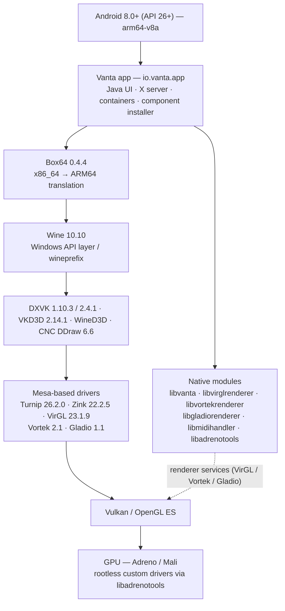

# Vanta architecture

This document describes how the pieces in this repository fit together. It reflects what is
actually present in the source tree; anything not implemented is listed as planned in the
[README roadmap](../README.md#roadmap).

## High-level diagram

Execution summary: the app starts an X server inside Android, prepares a RootFS container, and
launches the Windows program through **Box64**, which hosts **Wine**. DirectX calls are translated
by the selected wrapper (DXVK, VKD3D, WineD3D or CNC DDraw) and finally reach the Android GPU
driver through a Mesa-based driver (Turnip for Vulkan on Adreno, Zink for OpenGL-over-Vulkan,
VirGL/Vortek/Gladio renderer components for the OpenGL paths).

> **Box64 vs Box86:** only Box64 ships in `app/src/main/assets/box64/`. Box86 is credited together
> with Box64 upstream, but no Box86 binary exists in this repository.

## Layers and where they live

### 1. Application layer (Java, `app/src/main/java/io/vanta/app/`)

| Area | Package / entry points | Responsibility |
|---|---|---|
| UI | `MainActivity`, `SettingsFragment`, `ContainersFragment`, `ContainerDetailFragment`, `ShortcutsFragment`, `InputControlsFragment` | Main screens, settings, container and shortcut lists |
| Containers | `container/` (`Container`, `ContainerManager`, `GraphicsDrivers`, `DXWrappers`, `AudioDrivers`) | Container model, persistence and per-container options |
| Dialogs | `contentdialog/` (`DXVKConfigDialog`, `VKD3DConfigDialog`, `WineD3DConfigDialog`, `TurnipConfigDialog`, `VirGLConfigDialog`, `VortekConfigDialog`, …) | Per-component configuration |
| Box64 | `box64/` (`Box64PresetManager`, `Box64EditPresetDialog`) | Box64 presets and environment variables |
| Components | `core/GeneralComponents`, `core/DefaultVersion`, `core/WineInstaller` | Bundled/installable component handling and default versions |
| X server | `xserver/` (in-app X11 implementation: windows, pixmaps, cursors, GLX extension) | X11 surface on top of Android |
| Environment | `xenvironment/` (`RootFS`, `RootFSInstaller`, `XEnvironment`, `components/`) | RootFS extraction, environment components (X server, PulseAudio/ALSA, guest launcher, renderer components) |
| Guest launch | `xenvironment/components/GuestProgramLauncherComponent` | Starts Wine/Box64 with the selected preset and env vars |
| Display | `XServerDisplayActivity` | Fullscreen runtime, wires drivers and renderers together |
| Input | `inputcontrols/`, `ControlsEditorActivity`, `ExternalControllerBindingsActivity` | Touch controls, gamepad and external controller bindings |
| Services | `services/ForegroundService` | Background/foreground service and notifications |

### 2. Native layer (CMake, `app/src/main/cpp/`)

| Module | Output | Role |
|---|---|---|
| `vanta/` | `libvanta` | X connector (epoll socket protocol), GPU helpers, DMA/ring buffer, SysV shared memory, Wine registry editing |
| `virglrenderer/` | `libvirglrenderer` | VirGL server: virtualized OpenGL for the guest (sources carry Red Hat copyright notices) |
| `vortekrenderer/` | `libvortekrenderer` | Vortek renderer server (`/tmp/.vortek/V0`) |
| `gladiorenderer/` | `libgladiorenderer` | Gladio OpenGL renderer used by the GLX extension |
| `midihandler/` | `libmidihandler` | MIDI handling backed by bundled FluidSynth libraries |
| `libadrenotools/` | `libadrenotools` | Rootless custom Adreno driver loading (BSD-2-Clause, Billy Laws) |

`app/src/main/cpp/CMakeLists.txt` wires the modules together; the build is configured from
`app/build.gradle` (NDK `24.0.8215888`, CMake `3.22.1`, ABI `arm64-v8a`).

### 3. Runtime assets (`app/src/main/assets/`)

| Asset | Contents |
|---|---|
| `box64/` | `box64-0.4.4.tzst`, `default.box64rc`, env-var definitions |
| `dxwrapper/` | `dxvk-1.10.3.tzst`, `dxvk-2.4.1.tzst`, `d7vk-1.11.tzst`, `d8vk-1.0.tzst`, `vkd3d-2.14.1.tzst`, `cnc-ddraw-6.6/` |
| `graphics_driver/` | `turnip-26.2.0.tzst`, `zink-22.2.5.tzst`, `virgl-23.1.9.tzst`, `vortek-2.1.tzst`, `gladio-1.1.tzst` |
| `rootfs.tzst`, `container_pattern.tzst`, `rootfs_patches.tzst` | Guest filesystem and container template |
| `wincomponents/` | DirectX/VCRuntime installer components |
| `inputcontrols/`, `soundfont/`, `wallpapers/`, `dxwrapper/` | UI and runtime media |
| `common_dlls.json`, `wine_startmenu.json`, `wine_debug_channels.json`, `gamepad_models.json`, `gpu_cards.json` | Metadata tables used by the UI |

### 4. Prebuilt libraries (`app/src/main/jniLibs/arm64-v8a/`)

PulseAudio 13.0 stack, GLib, Oboe, Opus/FLAC/Vorbis/OGG/SndFile, libsndfile and related libraries
used by the audio and MIDI paths.

## Data flow of a game start

1. `ContainersFragment` → `ContainerDetailFragment`: the user selects screen size, graphics drivers
   (Vulkan + OpenGL), DX wrapper and its options, audio driver, Box64 preset and env vars.
2. `XServerDisplayActivity` is started; it builds an `XEnvironment` with the required components
   (`XServerComponent`, audio component, `VirGLRendererComponent`/`VortekRendererComponent`, …).
3. `RootFSInstaller` prepares the container directory and wineprefix from the bundled RootFS.
4. `GuestProgramLauncherComponent` extracts the selected Box64/DXVK/Turnip components and launches
   the Windows program through Wine under Box64.
5. Wine renders through the selected wrapper; the resulting Vulkan/OpenGL work reaches the Android
   GPU driver (Turnip loaded rootlessly through `libadrenotools` when applicable).
6. Frames are presented through the in-app X server/OpenGL path; audio goes through PulseAudio or
   ALSA components to the Android audio output.

## Planned architectural work

Not implemented — see the [README roadmap](../README.md#roadmap):

- first-party Vanta interface (today the upstream layout is still used);
- Compatibility Manager, DXVK Manager and Turnip managers;
- FEX as an alternative translation backend;
- Vanta-hosted repository for installable components (today the app downloads them from the
  Winlator upstream repository — see [CREDITS.md](../CREDITS.md)).
